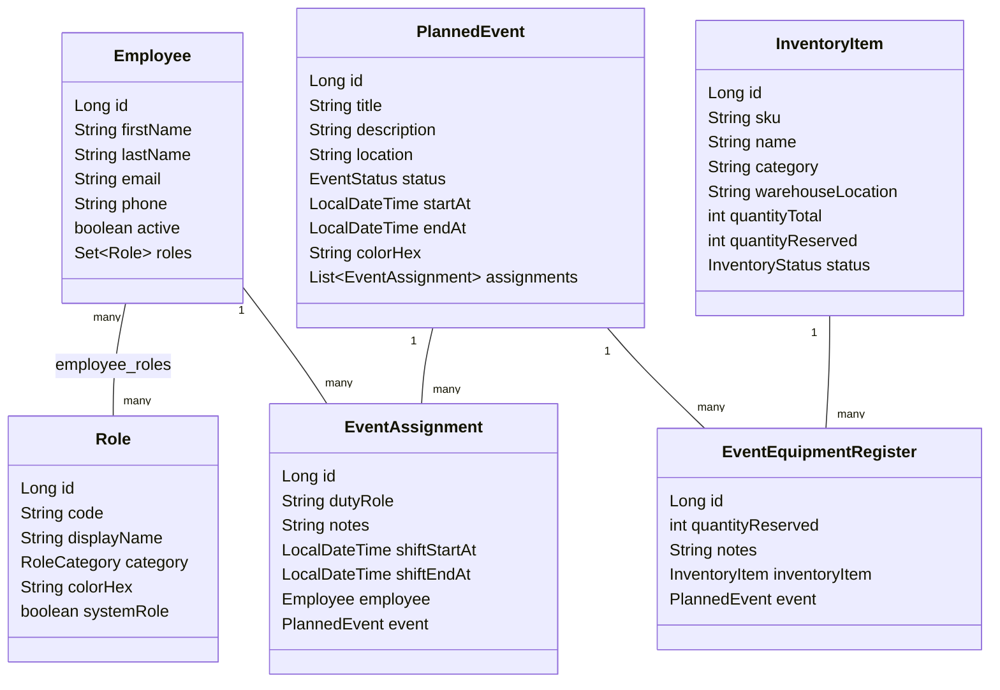
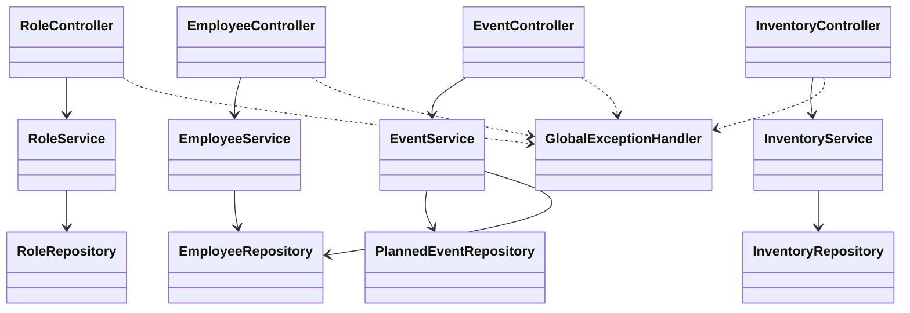

# Class Diagrams

## Core Domain Diagram

```mermaid
classDiagram
  class Role {
    Long id
    String code
    String displayName
    RoleCategory category
    String colorHex
    boolean systemRole
  }

  class Employee {
    Long id
    String firstName
    String lastName
    String email
    String phone
    boolean active
    Set~Role~ roles
  }

  class PlannedEvent {
    Long id
    String title
    String description
    String location
    EventStatus status
    LocalDateTime startAt
    LocalDateTime endAt
    String colorHex
    List~EventAssignment~ assignments
  }

  class EventAssignment {
    Long id
    String dutyRole
    String notes
    LocalDateTime shiftStartAt
    LocalDateTime shiftEndAt
    Employee employee
    PlannedEvent event
  }

  class EventEquipmentRegister {
    Long id
    int quantityReserved
    String notes
    InventoryItem inventoryItem
    PlannedEvent event
  }

  class InventoryItem {
    Long id
    String sku
    String name
    String category
    String warehouseLocation
    int quantityTotal
    int quantityReserved
    InventoryStatus status
  }

  Employee "many" -- "many" Role : employee_roles
  PlannedEvent "1" -- "many" EventAssignment
  Employee "1" -- "many" EventAssignment
  PlannedEvent "1" -- "many" EventEquipmentRegister
  InventoryItem "1" -- "many" EventEquipmentRegister
```

## Service and Controller Layers

```mermaid
classDiagram
  class RoleController
  class RoleService
  class RoleRepository

  class EmployeeController
  class EmployeeService
  class EmployeeRepository

  class EventController
  class EventService
  class PlannedEventRepository

  class InventoryController
  class InventoryService
  class InventoryRepository

  class GlobalExceptionHandler

  RoleController --> RoleService
  RoleService --> RoleRepository

  EmployeeController --> EmployeeService
  EmployeeService --> EmployeeRepository

  EventController --> EventService
  EventService --> PlannedEventRepository
  EventService --> EmployeeRepository

  InventoryController --> InventoryService
  InventoryService --> InventoryRepository

  RoleController ..> GlobalExceptionHandler
  EmployeeController ..> GlobalExceptionHandler
  EventController ..> GlobalExceptionHandler
  InventoryController ..> GlobalExceptionHandler
```
